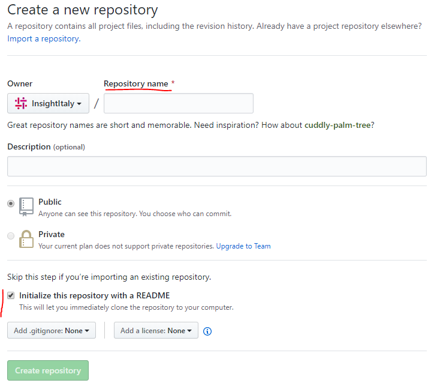
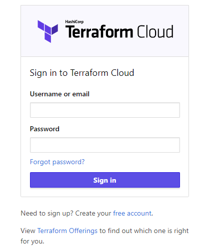
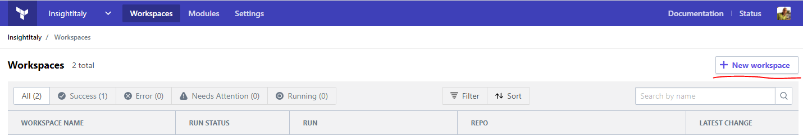
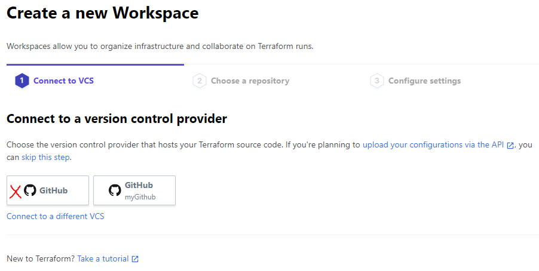
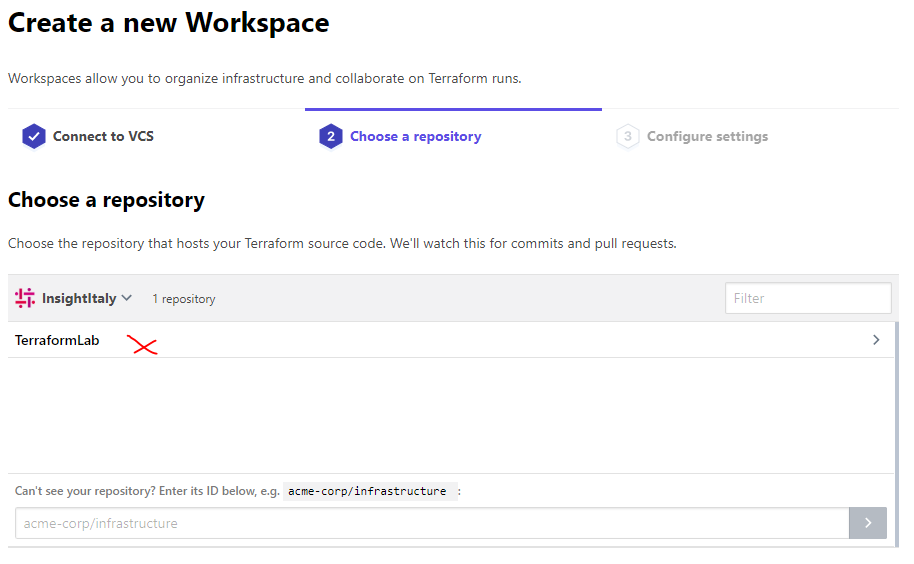
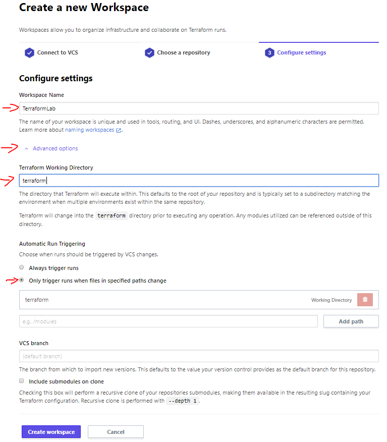
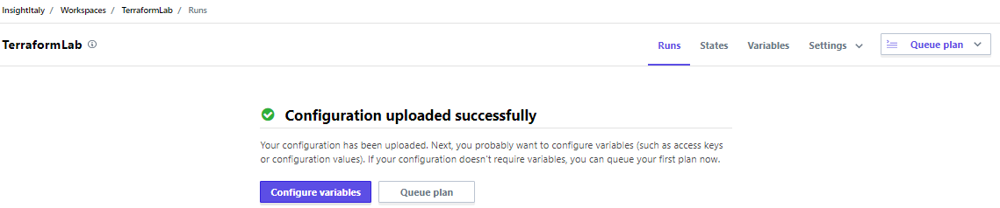
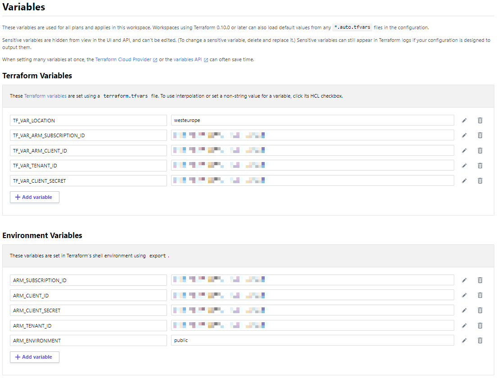

# Terraform  for Insight Consultant
Here you will find the  Terraform code and the basic instructions for creating a basic Terraform environnent.

## Setup environment

### Terraform
First of all, you have to install **Terraform** locally. To install it, [download](https://www.terraform.io/downloads.html) the appropriate package for your operating system into a separate install directory. The download contains a single executable file, for which you should also define a global path. For instructions on how to set the path on Linux and Mac, go to [this webpage](https://stackoverflow.com/questions/14637979/how-to-permanently-set-path-on-linux). For instructions on how to set the path on Windows, go to [this webpage](https://stackoverflow.com/questions/1618280/where-can-i-set-path-to-make-exe-on-windows).

Verify your path configuration with the *terraform* command. A list of available Terraform options is shown, as in the following example output:

> `azureuser@Azure:~$ terraform`
>
> `Usage: terraform [--version] [--help] <command> [args]`

#### Set up Terraform access to Azure

To enable Terraform to provision resources into Azure, create an [Azure AD service principal](https://docs.microsoft.com/en-us/cli/azure/create-an-azure-service-principal-azure-cli) using [Azure Az Powershell module](https://docs.microsoft.com/en-us/powershell/azure/new-azureps-module-az). The service principal grants your Terraform scripts to provision resources in your Azure subscription.

If you have multiple Azure subscriptions, first query your account with [az account list](https://docs.microsoft.com/en-us/cli/azure/account#az-account-list) to get a list of subscription ID and tenant ID values:

> ` az account list --query "[].{name:name, subscriptionId:id, tenantId:tenantId}"`

To use a selected subscription, set the subscription for this session with [az account set](https://docs.microsoft.com/en-us/cli/azure/account#az-account-set). Set the ``SUBSCRIPTION_ID`` environment variable to hold the value of the returned id field from the subscription you want to use:

> `az account set --subscription="${SUBSCRIPTION_ID}"`

Now you can create a service principal for use with Terraform. Use [az ad sp create-for-rbac](https://docs.microsoft.com/en-us/cli/azure/ad/sp#az-ad-sp-create-for-rbac), and set the scope to your subscription as follows:

> `az ad sp create-for-rbac --role="Contributor" --scopes="/subscriptions/${SUBSCRIPTION_ID}"`

Your ``appId``, ``password``, ``sp_name``, and ``tenant`` are returned. Make a note of the ``appId`` and ``password`` (below are ARM_CLIENT_ID and ARM_CLIENT_SECRET respectively).

#### Configure Terraform environment variables

To configure the local installation of Terraform to use your Azure AD service principal, set the following environment variables, which are then used by the [Azure Terraform modules](https://registry.terraform.io/modules/Azure). You can also set the environment if working with an Azure cloud other than Azure public.

* ARM_SUBSCRIPTION_ID
* ARM_CLIENT_ID
* ARM_CLIENT_SECRET
* ARM_TENANT_ID
* ARM_ENVIRONMENT

You can use the following sample shell script to set those variables:

> ``#!/bin/sh``
>
> ``echo "Setting environment variables for Terraform"``  
> ``export ARM_SUBSCRIPTION_ID=your_subscription_id``   
> ``export ARM_CLIENT_ID=your_appId``  
> ``export ARM_CLIENT_SECRET=your_password``  
> ``export ARM_TENANT_ID=your_tenant_id`` 
> 
> ``# Not needed for public, required for usgovernment, german, china``  
> ``export ARM_ENVIRONMENT=public``

#### Use variable declaration

Instead of use environment variables, you can create a "variable declaration section" inside your .tf file.

> ``provider "azurerm" {``  
> ``    subscription_id = "xxxxxxx-xxxx-xxxx-xxxx-xxxxxxxxxxxx"``    
> ``    client_id       = "xxxxxxx-xxxx-xxxx-xxxx-xxxxxxxxxxxx"``  
> ``    client_secret   = "xxxxxxx-xxxx-xxxx-xxxx-xxxxxxxxxxxx"``  
> ``    tenant_id       = "xxxxxxx-xxxx-xxxx-xxxx-xxxxxxxxxxxx"``  
> ``}``  

#### CLI Configuration File (``.terraformrc`` or ``terraform.rc``)
The CLI configuration file configures per-user settings for CLI behaviors, which apply across all Terraform working directories. This is separate from your infrastructure configuration.

The configuration is placed in a single file whose location depends on the host operating system:

On Windows, the file must be named ``terraform.rc`` and placed in the relevant user's ``%APPDATA%`` directory. The physical location of this directory depends on your Windows version and system configuration; use ``$env:APPDATA`` in PowerShell to find its location on your system.

The location of the Terraform CLI configuration file can also be specified using the ``TF_CLI_CONFIG_FILE`` environment variable.

The configuration file uses the same HCL syntax as .tf files, but with different attributes and blocks. The following example illustrates the general syntax;

> ``plugin_cache_dir   = "$HOME/.terraform.d/plugin-cache"``    
> ``disable_checkpoint = true``

You can provide credentials for use with Terraform Cloud. Terraform uses this when performing remote operations or state access with the remote backend and when accessing Terraform Cloud's private module registry.

This setting is a repeatable block, where the block label is a hostname (either app.terraform.io or the hostname of a Terraform Enterprise instance) and the block body contains a token attribute. Whenever Terraform accesses state, modules, or remote operations from that hostname, it will authenticate with that API token.

> ``credentials "app.terraform.io" {``   
> ``  token = "xxxxxx.atlasv1.zzzzzzzzzzzzz"``   
> ``}``

[Here](https://www.terraform.io/docs/commands/cli-config.html) the complete reference.

### Visual Studio Code

To edit Terraforms files (.ts) we advice to use Visual Studio Code as Free code editor.
You can download and install Visual Studio Code [here](https://code.visualstudio.com/).

#### Visual Studio Code Extensions for Terraform and GitHub

Visual Studio Code can be able to load extensions from a Marketplace. We advice to install the extensions below:
- [Azure Terraform](https://marketplace.visualstudio.com/items?itemName=ms-azuretools.vscode-azureterraform) - The extension provides terraform command support, resource graph visualization and CloudShell integration inside VSCode.
- [Terraform](https://marketplace.visualstudio.com/items?itemName=mauve.terraform) - The extension provides Syntax highlighting, linting, formatting, and validation for Terraform.
- [GitHub Pull Request](https://marketplace.visualstudio.com/items?itemName=GitHub.vscode-pull-request-github) - The extension allows you to review and manage GitHub pull requests in Visual Studio Code.

### GitHub Desktop

GitHub Desktop is a cross-platform application that allow you to manage GitHub repositories. You can install it downloading binaries [here](https://desktop.github.com/).

---

## GitHub 

Access to [GitHub](https://github.com) with your credentials and create a new repository using [this link](https://github.com/new).

Enter your Repository name and be sure to check "Initialize this repository with a README"

..

## Terraform Cloud
Now you have to access to a **Terraform Cloud** workspace. Use an existing account [here](https://app.terraform.io/session) or create a new one for free.

Once you are logged in, you have to create a new workspace:

Connect to a Version Control. Choose **GitHub** and select your GitHub project.
The GitHub project must be not empty (create at least a README.md file).

Choose a repository

Now you have to configure settings.
First of all, you have to choose a Workspace name.
Then, clicking on "Advance options", you can enter a **Terraform Working Directory**. Enter a directory name, you can trigger runs only when a file in that specified path change (you can specify more path).

Once the workspace are created ad configured, you can configure variables.

You have to add all the variables showed in the image below

---

## Clone GitHub Project

When you create a repository on GitHub, it exists as a remote repository. You can clone your repository to create a local copy on your computer and sync between the two locations.

This procedure assumes you have already created a repository on GitHub, or have an existing repository owned by someone else you'd like to contribute to.

1. On GitHub, navigate to the main page of the repository. Under the repository name, click *Clone or download*.

2. In the *Clone with HTTPS* section, click the icon right to the clone URL to copy the clone URL for the repository

3. Open Git Bash/Command Prompt/Powershell 
4. Change the current working directory to the location where you want to clone directory to be made.
5. Type `git clone`, and paste the URL you copied in Step 2. If you don't have Git, install it from [here](https://gitforwindows.org/).  
`$ git clone https://github.com/YOUR-USERNAME/YOUR-REPOSITORY`
6. Press *Enter*. Your local clone will be created.   
`$ git clone https://github.com/YOUR-USERNAME/YOUR-REPOSITORY`  
`> Cloning into 'YOUR-REPOSITORY'...`   
`> remote: Counting objects: 10, done.`   
`> remote: Compressing objects: 100% (8/8), done.`   
`> remove: Total 10 (delta 1), reused 10 (delta 1)`    
`> Unpacking objects: 100% (10/10), done.`   

### Cloning a repository to GitHub Desktop
1. On GitHub, navigate to the main page of the repository.

1. Under your repository name, click  to clone your repository in Desktop. Follow the prompts in GitHub Desktop to complete the clone. For more information, see "[Cloning a repository from GitHub to GitHub Desktop.](https://help.github.com/en/desktop/guides/contributing-to-projects/cloning-a-repository-from-github-to-github-desktop/)"

